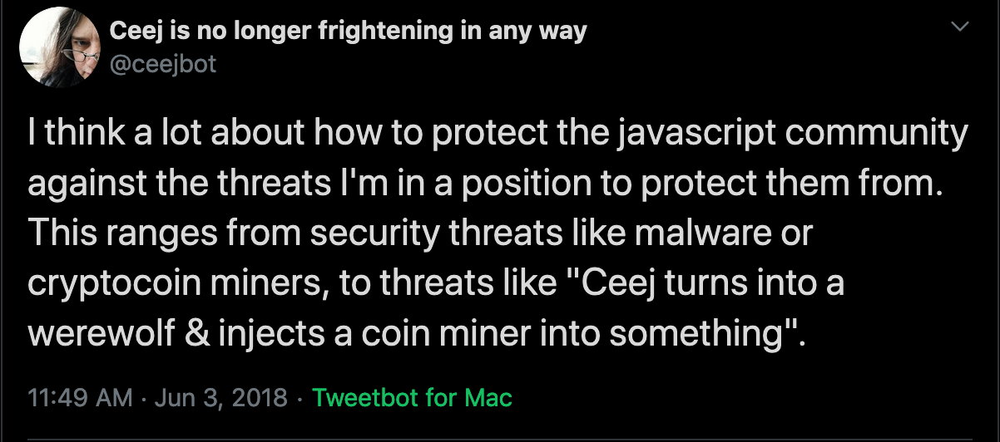
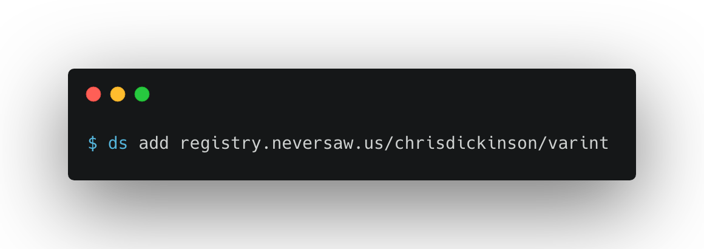
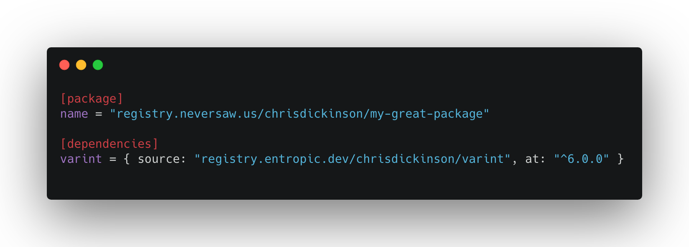
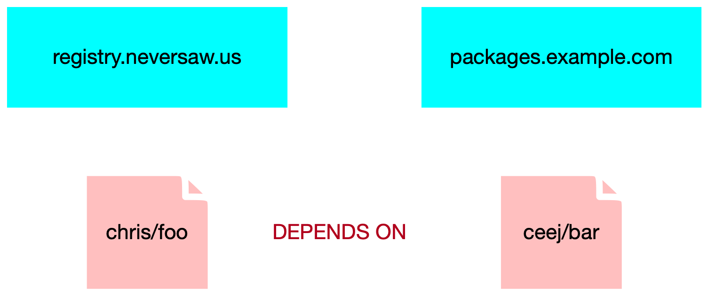
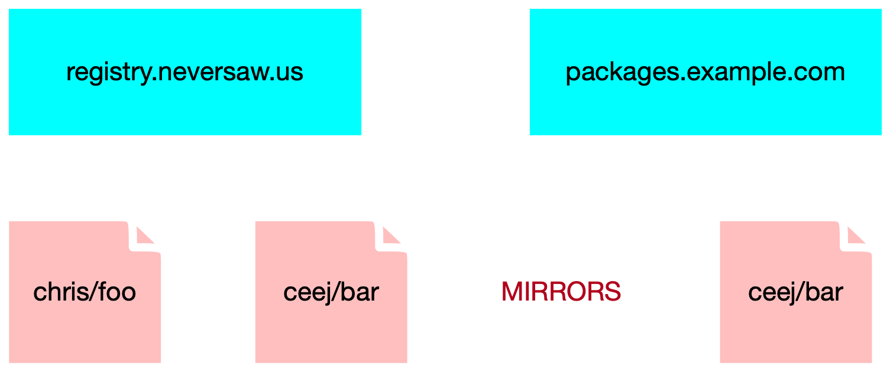
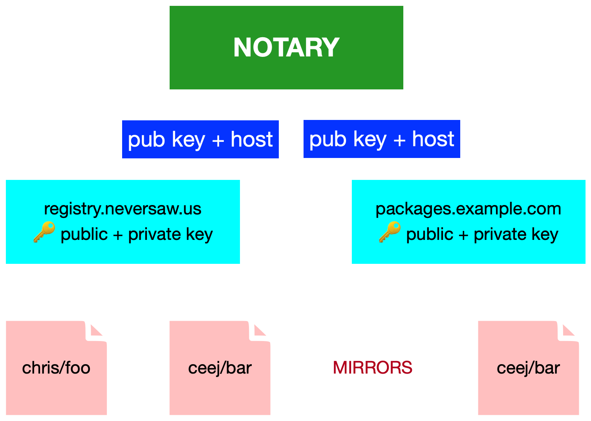
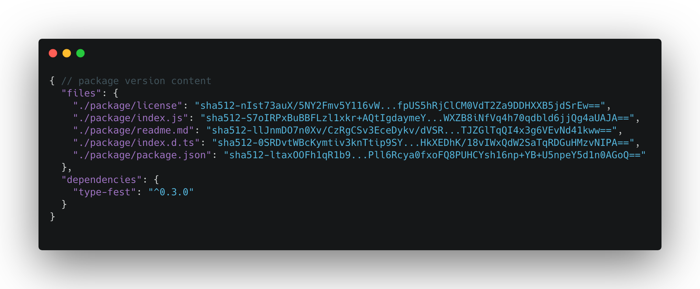
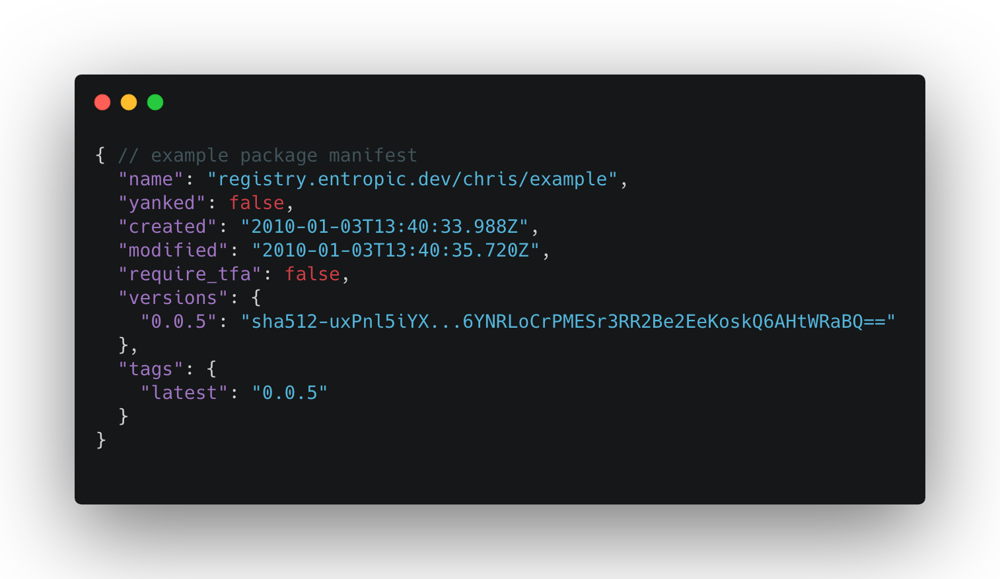
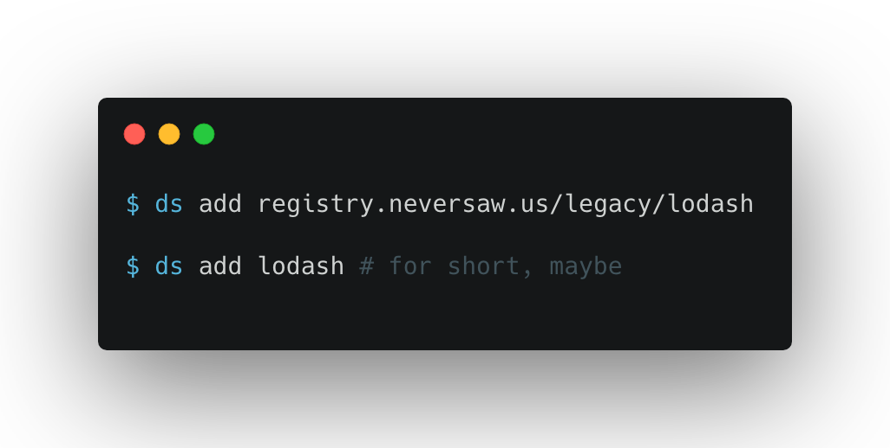

# hi, I'm chris

- chrisdickinson on github
- isntitvacant on twitter

^ welcome to my secret presenter notes. hi hello everyone. My name is Chris
Dickinson. I work with CJ at a company called Eaze, and before that I worked at
npm for about 4 years. I accidentally turned registry.yarnpkg.com into a teapot
in an ill-fated use of the 418 status code. Sorry.

---

# package management

^ Code you write depends on code other people write, and you need some way to
get it, and boom, you have package management.
 
---

## there's something
# [fit] **wrong**
## with package management

^ Every language ecosystem builds some form of package management. Even tooling
ecosystems -- like docker -- build it. The wheel has been thoroughly
reinvented.

---

# :fire::package::fire:

^ However. The most at-hand way to build package managers also happens to
have bad interactions with the way our industry is constructed and funded.

---

### a **brief** aside

^ This talk is something of a sequel to Ceej's "Economics of Open
Source", delivered this year at JSConf EU. My hope is that this will be a
sequel in the vein of James Cameron films -- expanding the universe in an
approachable way for folks who didn't see the original. You can enjoy
Terminator 2 without getting caught up with Terminator 1, for example.

---

> 🧙🏻‍♂️

^  I might miss the mark and head down the Silmarillion path though. If I do,
let me know, that's worth Tolkien about.

---

# [fit] in media res

^ Let's set the stage. Our story thus far: Over the last 10 years, we -- you,
me, everyone in this room, and lots of folks outside of it -- built the largest
package ecosystem in the world. We've changed the common practice of our trade
dramatically: we've changed how we build web applications, run open source
projects, build desktop applications, even how we teach new programmers.

---

# :revolving_hearts:

^ We've done this to scratch our own itches and because it's gratifying to
help others scratch their itches.

---

# :revolving_hearts:

^ Today, we're able to take advantage of the efforts of hundreds or thousands
of programmers just by typing "npm install". The dependency graph for a common application is both wide and deep. That graph represents trust.

---

# 👩🏾‍💻:package:👨🏻‍💻:package:👨🏽‍💻:package:👩🏼‍💻

^ Trust is a tradeoff. It means you can leverage the efforts of the community, but any one of those people could choose to harm you. There's a lot of potential -- power -- in trust. It helps us achieve things we couldn't on our own.

---

# 👩🏾‍💻:package:👨🏻‍💻:package:👨🏽‍💻:package:👩🏼‍💻

^ Generally this works out -- you choose who you directly trust, and most trustworthy actors in the system will behave similarly. Because you have the choice, you are empowered. There is, however, one set of folks who you _must_ trust in a centralized package management system: the folks providing the registry.

---

# 🤖
## 👩🏾‍💻:package:👨🏻‍💻:package:👨🏽‍💻:package:👩🏼‍💻

^ There's a lot of power in that implicit trust.

---

^ CJ used to fret about this power in her time at npm. She'd put it to us this
way: yes, you can trust me now, but what if I turn into a werewolf? Can you
protect the registry from an untrustworthy actor inside the system? How does
the community verify they are not, unbeknownst to them, relying on the efforts
of werewolves out to harm them?

---

# 🤖
## 👩🏾‍💻:package:👨🏻‍💻:package:👨🏽‍💻:package:👩🏼‍💻

^ Because we built this commons on top of a privately-controlled, centralized
registry, we have no recourse but to trust the people with the legal rights to
run it, giving them ultimate power over the registry. Many of my former
colleagues are among them, and I think they're generally trustworthy, nice
people!

---

# :zap:

^ But: change is the only constant: they won't work there forever. The
current owners of the registry may not be the future owners. Taking that into
account, should this power even exist?

---

# :zap:

^ Why **does** this power exist? Why do other communities follow this pattern? Even when that power is placed into the hands of a foundation, it doesn't disappear. 

---

# :gem:
# :snake: :zap: :whale:
# 🦀

^ PyPI, RubyGems, Docker Registry, Cargo, to name a few, are all built this way. There are good people in these ecosystems too, and I don't think they're werewolves (or interested in becoming werewolves.) So, why are all these registries patterned on werewolf-enabling architecture?

---

^ You have to look at what constraints make a package registry successful, and what the most at-hand ways to achieve those constraints are.

---

# tradeoffs

^ A successful registry system must strike a frictionless balance between
individuals giving up some control over what they publish, and the benefits
they receive in exchange. This can be small: as an individual contributor, I
don't get final say in my package name. If I wanted to go publish my great new
typography subscripting algorithm, "lodash", to the registry, the registry
would tell me: no dice, pick another name.

---

# tradeoffs

^ More contentious: if I want to remove my code from the registry, I can't. Once
it's there, it's there. The pressure of other people relying on my code means
that registries are compelled to fix published code in place. If I want to run
ads or install a bitcoin miner in my popular package, the registry is empowered
to remove that version, or change my release lines out from under me to prevent
that. I don't wholly own my package.

---

## I'm **willing**
# to make
## these **tradeoffs**

^ These are tradeoffs I am, in general, willing to make. Other people making
these tradeoffs alongside me means that I am able to trust the code I'm
installing. However, note that the registry has to insert itself -- through
support, through tooling, through delivery -- into each of these tradeoffs. And
only the registry can do so with any measure of authority. Further note that
the community doesn't get a say in the rules unless the registry provider
chooses to listen. Bad tradeoffs are embedded in the good tradeoffs.

---

### hot potatoes **colon slash slash**
## www **dot** registry **dot** biz

^ The most at-hand way to build something like this is to host package metadata
at some well-known URL scheme, hosted at a well-known fully-qualified domain
name. Some, like npm, may even host the artifacts, representing the code
carried in a single version of the package, themselves. From there, folks
usually layer on an access control system, then expose a mechanism for logging
in and publishing new packages. This gives the operators of the registry the
control they need to assert authority over the ecosystem they host.

---

# 💸

^ However, that control comes at a cost in the long run. It means paying hosting
companies for machines and bandwidth, paying people to handle support issues,
and paying other people to make sure the system scales with use. The bigger the
package ecosystem the registry supports, the more it costs to host and support.
At the same time, the bigger the package ecosystem is, the more useful it is to
everyone working inside of it. Growth is encouraged, but the cost to support
that growth keeps rising.

---

## why should
## we worry

^ Many ecosystems use the pattern of a centralized registry. Why should we, in
the JavaScript community, be especially concerned? As folks who saw Ceej's talk
will remember: our registry is run by a for-profit, VC-funded private company.
And as a VC-funded company, it is primarily a financial instrument -- an
investment from the folks with money, with the expectation of extracting more
money out of the company when the time comes. When I joined npm in 2015, I thought
that wrapping the ecosystem with a company was a novel, promising way to pay for
the rising costs of supporting the ecosystem.

---

# **nerfed** personnel manifest

^ 2019 was an eyeopener. This year has been rocky for npm. npm lost 18 people across engineering, support, and marketing; often at very high levels.

---

# nlrb **problems**, many

^ npm settled 4 National Labor Review Board cases.

---

# new problematic **management**

^ There's been a massive amount of C-level changeover.

---

# **notable** package manager

^ GitHub launched their package registry. If there was doubt before, it's gone
now: centralized package management is not a product in itself. It is a
line-item feature of a centralized product.

---

^ I started in 2015 and stayed until this year. I stayed as long as I could,
probably longer than I should've. There are still a lot of really great people,
who I want to cheer on from the outside. But I worry that npm no longer has a
lever big enough to live up to their mission: take JavaScript to the stars.

---

# :star:

^ When I left to start my new gig, I took three weeks off in between. It was at
this point that Ceej and I decided to do something about package management,
because we were deeply concerned. We wrote the first version of our federated
registry system, Entropic, together over the course of 5 weeks. Ceej announced
it at JSConf EU on the fifth of June.

---

# :gem:
# :snake: :package: :whale:
# 🦀

^ I suspect the reason all of these registries -- Cargo, PyPI, Rubygems, npm --
are built the way they are is because it's easy to design and implement a
centralized registry. It's expensive to scale them, which is generally not a
problem a new registry has until it's achieved some degree of success. This is
to say: we build easy-to-build registries because we are not guaranteed to
encounter the downsides, which come due years later _if_ we are successful.
Indeed, the first version of Entropic was centralized, and it took roughly a
week and a half to build.

---

# :gem:
# :snake: ⛅️ :whale:
# 🦀

^ On the other hand, decentralized registries are hard to build, but cheap to
scale. They're hard to build because, as you'll recall, good registry systems
are built on enforcing trust-enhancing, friction-reducing tradeoffs for their
users, and this is easiest to build if there's a global authority. When there's
no central authority holding the keys, these tradeoffs are harder to enforce.
For instance: how do you keep foundational packages from being removed from a
decentralized system?

---

# [fit] ENTROPIC

^ In building Entropic we dissected these tradeoffs and came to the following
conclusions.

---

^ First, we need to enforce naming constraints: two distinct lodashes are
okay, but in order to disambiguate them we'll take into account the user that
published them as well as the URL of the Entropic to which they were first
published.

---

^ This is a pretty big change from the existing package name spec, and it's kind
of a mouthful. In order to make `require('lodash')` "just work", we introduced
a new package manifest format that allows aliasing these dependencies.

---

^ Thus, we built a client called "ds" (or entropy delta) that reads
`Entropic.toml` files. This has the handy side effect of avoiding friction with
existing packages: you can publish a single repository to both npm and
Entropic.

---

^ In order to enforce that dependencies don't disappear, packages are synced
between Entropic instances on use. In the above example, my "foo" package depends
on ceej's "bar" package, and they are published to different registries.

---

^ The act of creating this dependency causes my entropic to mirror the package
from ceej's entropic registry. Put another way: When I download
`packages.neversaw.us/chris/lodash` from `registry.entropic.dev`, it will
maintain a copy of that package indefinitely. This presents a trust problem:
can I trust that `registry.entropic.dev` faithfully conveyed the "real" lodash
to me?

---

^ Thus, we sign packages. The author signs the package metadata, the server
receiving the package signs the package metadata on publish, and every mirror
from there signs upon syncing that data. To ensure that spoofing isn't allowed,
we intend to build a distributed ledger exposing client-verifiable logs of the
combination of domains and their public key. The client-verifiable log comes to
us via Golang, and I'll include a link to it at the end.

---

# _T O F U_

^ This uses an ssh-style "trust on first use" system by default -- the first
time Entropic A syncs from an Entropic B that it hasn't seen before, it consults the
ledger to check that the B's public key matches the tuple advertised in the
ledger. If it's not present, the operator can opt to trust Entropic B and write
them into the ledger. This also helps with the problem of disappearing
registries.

---

^ In order to sync these packages between entropics and between entropics and
clients, we must make them stable. Thus, the packages are stored in
content-addressable form -- each file stored at a content hash, and the
per-version metadata is stored as a table of those content hashes.

---

^ The mutable top-level package information is the only non-content-addressable
data.

---

# goodbye,
# **download** counts

^ There's a casualty here: this means we no longer have download counts. The
upside is that security can be built by anyone, to the side: you could imagine
providing a service that advertises "known harmful" content hashes, which
Entropic instances could elect to heed & bail when downloading.

---

^ Finally, abandoning the value that we've built up on top of the centralized
registry is a non-starter. Thus, there's a special `legacy` namespace that
mirrors packages from npm on use. Because we're content-addressable, we can
verify that these package contents are the same, and we only need to store data
for one copy of them.

---

^ This is what we built, minus the ledger, in that 5 week period. It worked...
okay. We announced it on the fifth of June and here we are.

---

# So what *happened?*

^ We pretty quickly drew attention. This happened just as we were ramping up work
at our day jobs. Pretty soon: wham. We hit a wall. The first time I felt the
pinch was after pulling an all-nighter splitting the Entropic service into
multiple services. I announced that I would take a "vacation from GitHub" over
the weekend, which gave me space to think about the project a bit.

---

# ~~T~~**G**DD

^ The initial problem we ran into was guilt-driven development: We wanted to
reward people's efforts with quick PR merges. However, this often broke the
builds, and the lack of coordination about what was landing pretty quickly
spiraled into more work. To address this we put in place a "no working on
weekends" policy and created a "merge queue", which is a fancy way of saying "I
took on a release engineer role."

---

## the
# **pointy**
## end

^ We ground forward this way. We wanted to quickly extricate ourselves from the
project, so we brought up public forums and moderators (to whom I continue to
be thankful for.) However, we were feeling the pointy end of the economics
of open source.

---

# focus

^ There were still a lot of decisions to be made in the midst of a lot of
incoming undirected enthusiasm for the project, and directing these
conversations took a toll. A lot of the first few months were spent educating
people about decisions we had already made; in retrospect better documentation
would've been worth its weight in gold. Day jobs were starving the maintainers
of attention, so we were focused on "keeping the wheels on." One solution is to
add more maintainers, but that would required additional coordination, which
was in short supply. I personally struggled with the scope of decisions I
needed to weigh in on: I had a clear idea of how I wanted to build things, but
I had a hard time striking the balance between my desire for that level of
direction over the codebase and letting folks self-direct.

---

# _halt_

^ Eventually, the project ground to a halt around August after I took a weeklong
vacation and unspooled, Kat started her new job, and Ceej stepped into
management at $dayjob.

---

# code is
# **never**
# the challenge

^ Code is never the challenge, it's just what we (as a community) do well. We
learned some things. We're ready to try again.

---

# feedback loops

^ Splitting the service into multiple services exposed our first misstep: we
didn't have a deploy target. We had an EC2 box running nginx and the node
process in upstart, but no plans around the deploy flow.

^ People need concrete feedback loops. Developing the service locally did not
give people that feedback. We drew a lot of contributors looking to make our
`entropic.dev` website better, as it was (and still is!) entirely unstyled.
There wasn't a clear way to contribute, thus folks spun their wheels.

---

# communication

^ This looped into communication issues. Ceej and I are an effective team,
however we need to work on getting communications out from us. An early
example: it was unclear (and stressful) to newcomers to divine where we
were blessing certain dependencies over others. From our perspective, we're
very laissez-faire about picking packages when they are not mission-critical; but
when they start to affect the major access patterns of the site we start to
get more involved. However, that attitude _needed to be written down_ and
communicated. We came to that late.

---

# lessons learned

^ Generally: we asked for help at JSConf EU, but we didn't know what help we
needed yet. I think we have a better handle on that now: we're not building The
Entropic Registry, we're building the First Entropic registry. The important
part is nailing the protocol: the syncing between instances, publishing and
syncing between clients and instances, the manifest format for packages, and
what is expected of the server on receipt of packages.

^ The protocol is where we need the most help right now, particularly around
distributed ledgers.

---

# 📈 📉

^ Our ultimate goal is to make it easy and affordable to administer an Entropic
registry. This effort will only succeed if we invert the relationship between
"size of registry ecosystem" and "cost to support the registry." This means
there might not be a **single** Entropic codebase to fit all sizes! Ideally for
small instances, the cost of hosting & traffic should be around 5-10 dollars a
month. For larger instances suitable for supporting a company, 50-100 dollars
in hosting a month should be okay. You could picture small Entropics built out
of serverless tech: lambdas or cloudflare workers. Larger, "always-on"
instances might target Kubernetes and hosted Postgres.

---

# **federation** is the **future**
# 👨🏻‍🦲

^ The second most valuable way folks can help is by operating Entropic
registries. When we get to this point, we'll put out a call to interested
operators. At that point we'd be happy to hop on video calls with folks to get
them set up: we want to experience the friction of setting this up so we can
eliminate it.

^ Put another way: we think federation is the right way forward for package
registries, and we want to align doing the right thing with doing the easy
thing.

---

# bad stuff

^ So, what happens if this doesn't take off? I mean, it's something of a long
shot: most registries are built the way they're built because success isn't
guaranteed. Remember: our commons is in the hands of a financial instrument. If
they don't make it big -- really big -- someone else will buy the rights to our
commons. Who knows? That might be Microsoft. 

---

# [fit] github

^ I am a happy GitHub user. Today, that might look like a good thing. Tomorrow,
we might be back to the days of Gates: "embrace, extend, extinguish." Even if
the worst doesn't happen, control over the registry gives a company (or
foundation) immense power over an ecosystem. That company alone gets the keys
to ecosystem security, code analysis, rule-making, rule enforcement, and even
(in a subtle way) shaping how we write code by selectively messaging what
trends appear in the registry.

---

# :star:

^ I joined npm back in the day because I believed in the mission: take JavaScript
to the stars. I don't feel entirely comfortable pinning my hopes on a
corporation, even a presently good actor. I've experienced firsthand how
quickly a company can change. I'm here because I think this effort is our best
shot at disseminating a power that should never have been placed in one
company's hands alone. I believe in this community. With your help I think
we can take JavaScript to the stars together.

---

- https://research.swtch.com/tlog
